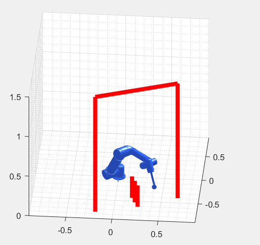
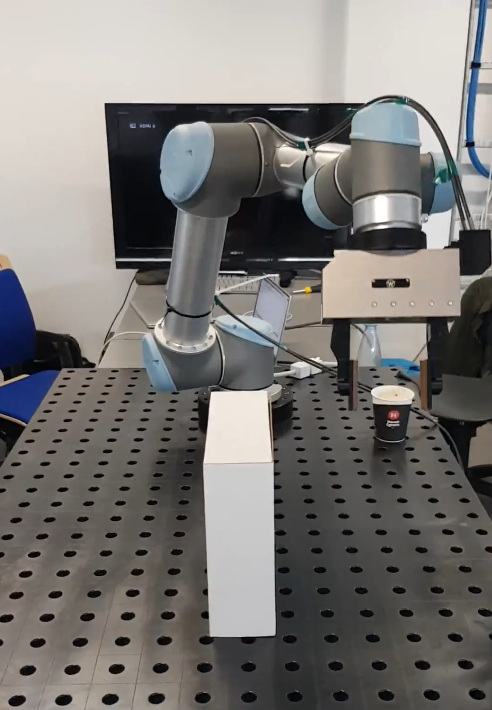

# Final Project - SDU Robotics Summer Course
Implementation of two motion planning algorithms:
	- Rapidly-exploring Random Tree (RRT)
	- Potential Field

The project report can be found [here](Report.pdf)


	
Both algorithms find collision-free paths for the UR5 robotic arm ([Universal Robots site](https://www.universal-robots.com/3d/ur5.html)) to perform pick-and-place tasks.

Scripts *MPExtendRRT.m* and *PotentialField.m* display a simulation of the UR5 robot following the path found and the obstacles defined.

A *\*.script* output file is generated with the commands for the real UR5 robot. 
Example:
```
...
movej([-0.83856, -1.96147, -1.06408, -1.06838, 1.58115, -1.01197], a=1, v=1, t=0, r=0)
movej([-0.834858, -2.04677, -1.06577, -1.07883, 1.61465, -0.997554], a=1, v=1, t=0, r=0)
movej([-0.860245, -2.12685, -1.0378, -1.09263, 1.64701, -0.967192], a=1, v=1, t=0, r=0)
movej([-0.83583, -2.1846, -1.08443, -1.11736, 1.62908, -1.02161], a=1, v=1, t=0, r=0)
...
```



[Video](https://josepquintana.me/files/videos/UR5/UR5%20robot%20motion%20planning%20-%20RRT%20algorithm.mp4) of the real UR5 robot following the generated path using the RRT algorithm


### Usage
Set up a a MEX compiler:
```
mex -setup C++
```

Initialize toolbox parameters:
```
run_me
```

Load demo variables (optional):
```
load demo_vars.mat
```

Run motion planning algorithm:
```
MPExtendRRT(initial_configuration, goal_configuration, obstacles)  
PotentialField(initial_configuration, goal_configuration, obstacles)  
```

*initial_configuration* is the initial configuration of UR5 (dimension: 1\*6, unit: radian)  

*goal_configuration* is the goal configuration of UR5 (dimension: 1\*6, unit: radian)  

*obstacles* represents all the capsule obstacles in the workspace (dimension: n\*7)  
  format of each row of *obstacles*: \[P_ini,  P_end,  r\] where P_ini is the x-, y- and z- coordinates of the initial point of the       interal line segment of the capsule (diemsion: 1\*3 unit: meter), P_end is the x-, y- and z- coordinates of the end point of the         interal   line segment of the capsule (diemsion: 1\*3 unit: meter), r is the radius of the capsule (scalar, unit: meter)  

 
